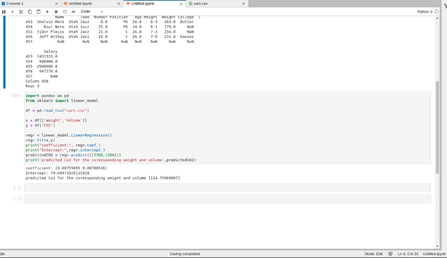

# Implementation of Multivariate Linear Regression
## Aim
To write a python program to implement multivariate linear regression and predict the output.
## Equipment’s required:
1.	Hardware – PCs
2.	Anaconda – Python 3.7 Installation / Moodle-Code Runner
## ALGORITHM:
### Step 1:
Import Pandas module
### Step 2:
Import linear_module from sklearn
### Step 3:
Declare data frame df to read the csv file
### Step 4:
Declare variable X equal to df with two arguments Weight and Volume
### Step 5:
Declare variable y equal to df with an argument CO2
### Step 6:
Declare a variable regr equal to linear_model.LinearRegression()
### Step 7:
declare regr.fit(X,y)
### Step 8:
Print regr.coeff_
### Step 9:
Print regr.intercept_
### Step 10:
Declare variable predictedCO2 equal to regr.predict with two arguments 33300, 1300
### Step 11:
Print variable predictedCO2

## Program:
~~~ python
"""
Name : RAGUL.VK
ref no : 21003061
"""
import pandas as pd
from sklearn import linear_model

df = pd.read_csv('cars.csv')
X = df[['Weight','Volume']]
y = df['CO2']
regr = linear_model.LinearRegression()
regr.fit(X,y)
print("Cofficients: ",regr.coef_)
print("Intercept: ",regr.intercept_)
predictedCO2 = regr.predict([[3300,1300]])
print('Predicted co2 for the corresponding weight and volume',predictedCO2)

~~~
## Output:

### Insert your output

 

## Result
Thus the multivariate linear regression is implemented and predicted the output using python program.